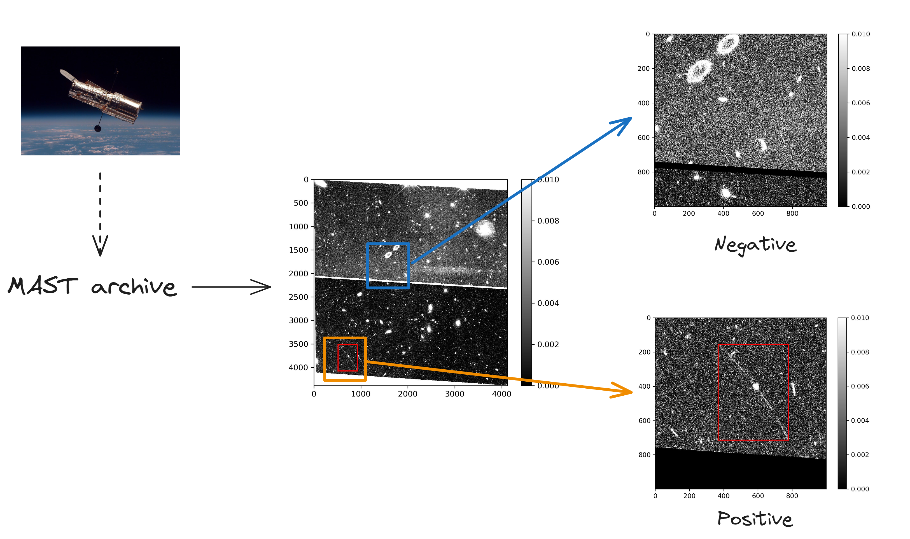
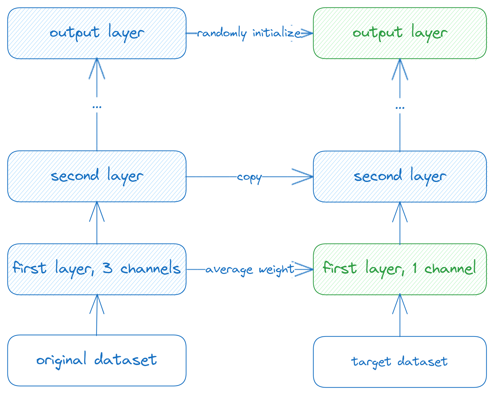

## Description

We propose implementing deep learning in the detection process of asteroids. Using data gathered from Hubble Space Telescope archive, we generate a dataset with around 3000 pictures. Then we tine-tune a pretrained model (previously trained on ImageNet) and design an automatic processing pipeline for the data.

## Prerequisites

We use Pytorch to build up and train the model. If you want to run the code locally, please make sure that Pytorch, torchvision, scikit-learn, numpy, matplotlib and some other typical data processing packages are properly installed.

Additionally, we use some packages that's specially designed for astronomy, which means the "astropy" and "astroquery" packages are also necessary. In order to download data from the MAST Hubble Telescope Archive, you probably need to use the MAST API from the astroquery package and need to finish some configuration. For more information, please read the doc [MAST Queries (astroquery.mast)](https://astroquery.readthedocs.io/en/latest/mast/mast.html)

## File structure

About the function of the file:

- download.ipynb: download Hubble data from MAST archive
- positive.ipynb: generate "positive" class pictures with asteroid trails
- negavite.ipynb: generate "negative" class pictures without asteroid trails
- fine-tune.ipynb: build up and train the model

## What's the idea

Thanks for the Hubble Asteroid Hunter citizen science project and the data they published, we can generate our labelled datasets for further image classification task.

This is our method to generate the training data:

We implement fine-tuning techniques to the classification task. This is how we build up the model:

## Current Results

Up to now, we achieved a best accuracy of 92.24% and recall of 91.25% when fine-tuning ResNet50. We are now improving the performance of our model.

## How to contribute

If you like our idea, please feel free to star or fork our repository, and send pull requests. You may also contact the author by sending emails to changsun@diroot.org

## References

1. Sandor Kruk et al. Hubble Asteroid Hunter: I. Identifying asteroid trails in Hubble Space Telescope images. Astronomy & Astrophysics, 661:A85, May 2022.
2. Kaiming He et al. Deep Residual Learning for Image Recognition, December 2015. Issue: arXiv:1512.03385 arXiv:1512.03385.
3. Preeti Cowan et al. Towards Asteroid Detection in Microlensing Surveys with Deep Learning. Astronomy and Computing, 42:100693, January 2023. arXiv:2211.02239.
